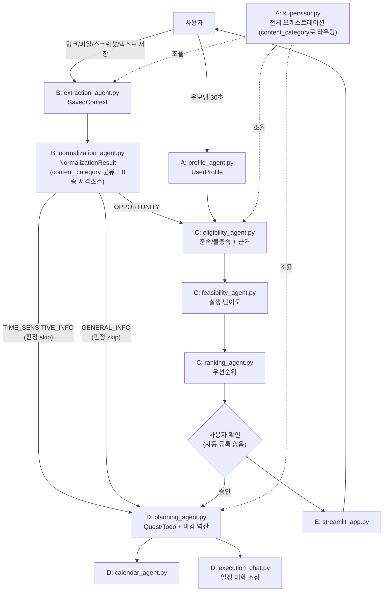

# ARCHITECTURE.md — 팀 전체 아키텍처

> 이 문서는 `Project.md`(제품 정의·규칙)를 전제로, 5인 역할이 코드 레벨에서
> 어떻게 연결되는지를 정의한다. 스키마를 바꿀 때는 이 문서와 `src/models.py`를
> 함께 갱신하고 팀에 공유할 것.

## 1. 전체 데이터 흐름

핵심: **B의 출력(NormalizationResult)이 C의 유일한 입력**이고, **C의 출력이 D의
유일한 입력**이다. 중간 단계 스키마가 깨지면 뒤 단계 전체가 멈춘다.

### 1-1. 중요: 사용자는 지원사업만 저장하지 않는다

실제 테스트로 확인된 문제. 사용자가 저장하는 건 공모전/지원사업만이 아니라 —
인스타 정보성 게시물(툴 소개, 팁), 행사/티켓 판매 공지처럼 **자격조건은 없지만
마감은 있는 것**, 완전히 정보성인 것까지 다양하다. 이걸 전부 "지원사업"처럼
취급해 C에게 넘기면 판정 자체가 무의미하거나 왜곡된다.

그래서 `normalize()`가 8종 조건 중 뭐가 뽑혔는지로 자동 분류한 `content_category`를
`NormalizationResult`에 포함한다 (별도 분류기 없이, 이미 하는 추출의 부산물):

| content_category | 의미 | 라우팅 |
|---|---|---|
| `opportunity` | 개인 자격조건(나이/지역/신분/소득/중복/병역) 있음 | C의 적격 판정 필요 → 기존 흐름 |
| `time_sensitive_info` | 자격조건은 없지만 마감/기간은 있음 (예: 행사 티켓 판매기간) | **C 판정 skip**, D가 마감만 추적해 알림 |
| `general_info` | 조건도 마감도 없음 (예: 툴 소개, 팁) | **C 판정 skip**, D가 마감 없이 "해볼래?" 형태로 제안 |

**A/D에게 요청**: Supervisor가 `content_category`를 보고 `opportunity`만 C로 보내고
나머지는 D로 바로 라우팅하도록 구현 필요. D의 `planning_agent.py`도 "마감이 있는
일정"뿐 아니라 "마감 없는 실행 제안"까지 다루도록 설계가 필요함 — Project.md의
"저장은 했는데 실행은 안 하는 청년" 문제가 지원사업에만 해당하는 게 아니라는 뜻.

## 2. 역할 ↔ 모듈 매핑

| 담당 | 역할 | 모듈 | 상태 |
|---|---|---|---|
| A 강옥일 | Supervisor, Profile/Interest Agent, models.py 소유 | `src/supervisor.py`, `src/profile_agent.py`, `src/models.py` | stub |
| **B 신민서** | **Extraction, Normalization, 공고 데이터** | `src/extraction_agent.py`, `src/normalization_agent.py`, `data/opportunities.json` | **구현 대상** |
| C 엄세연 | Eligibility, Feasibility, Ranking | `src/eligibility_agent.py`, `src/feasibility_agent.py`, `src/ranking_agent.py` | stub |
| D 김나연 | Planning, Execution Chat, Quest/Todo, 캘린더 | `src/planning_agent.py`, `src/execution_chat.py`, `src/quest_todo.py`, `src/calendar_agent.py` | stub |
| E 지수정 | Frontend | `app/streamlit_app.py` | stub |

## 3. 공용 계약 (Contracts)

이관 전까지는 각 모듈 상단에 draft로 정의하고, A가 `src/models.py`로 통합한다.

- **SavedContext** (B 출력 #1): 사용자가 저장한 원본 → 정제된 텍스트. `source_type: link/file/image/text`, `status: ok/partial/failed` 필수 (R3). 로그인월/JS SPA(예: Instagram)는 실패 처리 + 스크린샷 유도.
- **NormalizationResult** (B 출력 #2): `content_category`(opportunity/time_sensitive_info/general_info, 1-1 참고) + 자격조건 8종 리스트. `content_category=opportunity`일 때만 C의 입력으로 의미가 있음. 조건마다 `raw_quote` + `span` 필수 (R2, 가장 중요). 모르면 `operator="unknown"` (R4).
- **EligibilityVerdict** (C 출력, D의 입력 조건): 조건별 충족 여부 + 근거. 판정 로직은 C에게만 있다 (R1).
- **Plan / Quest** (D 출력): 마감 역산 일정, Quest/Todo 상태.

## 4. 기술 스택 및 실행 방식

- Python 3.11+, pydantic v2 (스키마 검증은 전 구간 공통)
- **로컬 우선**: LLM 호출부는 provider 교체가 쉽도록 인터페이스(Protocol) 뒤에 숨겨둔다
- **LLM 제공자 (2026-08-13 업데이트)**: AWS 채택 여부가 팀 차원에서 아직 불확실. B는
  우선 **Gemini API**(`gemini-flash-latest`, `.env`의 `GEMINI_API_KEY`)로 실제 연동을
  붙였다 — 더 이상 mock이 아니라 진짜 LLM 호출이 도는 상태. AWS로 확정되면
  `BedrockVisionLLMClient`/`BedrockNormalizationLLMClient`를 추가하고 기본 선택 로직
  (`_default_vision_client()`, `_default_llm_client()`)만 바꾸면 된다 — 인터페이스
  시그니처는 그대로.
  - 워크샵(Workshop-Healthcare-AgentCore)의 **Supervisor + Agent-as-Tool** 패턴은
    provider와 무관하게 그대로 유효 (A가 각 에이전트를 `@tool`로 감싸 호출)
  - Memory: 세션 내 단기 기억 + 사용자 선호/저장이력 장기 기억 (D의 추적 기능과 연결 가능) — AWS 확정 시 검토
  - Observability: 트레이스를 데모/발표에 활용 — AWS 확정 시 검토
- 데이터: 로컬 JSON (`data/opportunities.json`), DB 없음
- UI: Streamlit (E)

## 5. 배포 단계

1. **지금 (AWS 없음)**: 전 구간 로컬 실행, LLM은 mock, 파일 기반 데이터
2. **AWS 발급 후**: extraction/normalization의 LLM 호출부를 Bedrock+Strands로 교체, 필요 시 AgentCore Runtime에 배포
3. **최종 데모**: Streamlit 앱 하나로 전체 플로우 시연 (로컬 또는 EC2/Runtime)

## 6. 시상 기준과의 연결 (참고)

- **Best Agentic Innovator**: R1/R2/R6 규칙 기반의 "근거 있는 자율성" — 판정 근거를 원문으로 제시 가능한 점이 차별화
- **Autonomous Excellence**: Supervisor + Agent-as-Tool 멀티에이전트 워크플로우, 메모리로 "저장 후 미실행" 문제 추적
- **Smart Workflow**: 5인 역할의 명확한 스키마 경계와 협업 구조 자체가 강점
