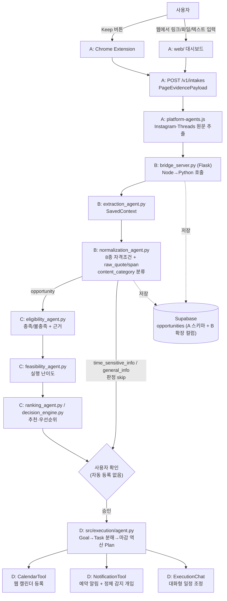

# ARCHITECTURE.md — KEEP:ON 실행 아키텍처

> Node 서비스(A, `services/keep-web/`)가 입력·추출 계층이고, 나머지(정규화·판정·실행)는
> Python(`src/`)이 담당한다. 두 런타임을 하나로 합치지 않고 **HTTP 브릿지**로 연결한다 —
> 왜 이렇게 나눴는지는 `docs/merge_plan_a_b.md` 참고.

## 1. 전체 데이터 흐름

핵심: **Node(A)는 원문 추출까지만** 하고, **자격조건 구조화는 반드시 Python normalize()를
거친다.** C와 D는 이미 이 8종 조건 구조를 입력으로 완전히 구현되어 있으므로, 이 계약을
우회하거나 다른 포맷으로 대체하면 C/D의 기존 코드가 깨진다.

## 2. 역할 ↔ 모듈 매핑

| 담당 | 역할 | 위치 | 상태 |
|---|---|---|---|
| A | Chrome Extension, Intake API, 플랫폼별 원문 추출, workflow 상태머신 | `services/keep-web/` | **구현 완료** |
| **B** | **정규화 브릿지, 8종 자격조건 구조화, DB 저장** | `src/bridge_server.py`, `src/extraction_agent.py`, `src/normalization_agent.py`, `src/db.py` | **구현 완료** |
| C | 적격 판정, 실행 가능성, 추천/랭킹 | `src/eligibility_agent.py`, `src/feasibility_agent.py`, `src/ranking_agent.py`, `src/decision_engine.py` | **구현 완료** |
| D | Task 분해, 마감 역산, Calendar/Notification, 대화형 조정 | `src/execution/` (+ `planning_agent.py` 등 얇은 진입점) | **구현 완료** |
| E | Frontend | `app/streamlit_app.py` 또는 `services/keep-web/web/` | 미착수 |
| A | 공용 스키마 정식화 | `src/models.py` | draft 단계 |

## 3. 공용 계약 (Contracts)

- **PageEvidencePayload** (A 출력, 브릿지 입력): `source_url`, `canonical_url`, `platform`,
  `page_title`, `body_text`, `links`, `published_at`, `evidence`, `captured_at`. Instagram/
  Threads 로그인월은 `capture_status: ACCESS_REQUIRED`로 표시되고 우회하지 않는다(R6).
- **SavedContext** (B, `body_text` → 정제된 원문): `source_type: link/file/image/text/
  extension`, `status: ok/partial/failed` 필수 (R3).
- **NormalizationResult** (B, C의 입력): `content_category`(opportunity/time_sensitive_info/
  general_info) + 자격조건 8종 리스트. 조건마다 `raw_quote` + `span` 필수 (R2, 가장 중요).
  모르면 `operator="unknown"` (R4). `_verify_grounding()`이 원문에 없는 인용을 코드로
  걸러낸다 — LLM(Gemini) 출력이 이 검증을 반드시 통과해야 채택된다.
- **EligibilityVerdict / FeasibilityVerdict / RankingResult** (C 출력, D의 입력 조건):
  조건별 충족 여부 + 근거. 판정 로직은 C에게만 있다 (R1).
- **ExecutionContext → Plan/Task/CalendarEvent/Notification** (D): 마감 역산 일정,
  Task 상태(todo/in_progress/done/overdue/blocked), 알림.

## 4. Node ↔ Python 브릿지 (핵심 설계)

Node의 `server/workflow.js`가 NORMALIZING 단계에서 자체 3종 카테고리 분류기 대신
`src/bridge_server.py`(Flask, 기본 포트 5001)를 호출한다. 브릿지는 `extraction_agent.py`/
`normalization_agent.py`를 그대로 감싸기만 하고, 결과를 Supabase `opportunities` 테이블에
B가 추가한 `content_category`/`conditions` 컬럼으로 저장한다. A의 기존 카드 필드
(title/summary/category/deadline)는 조건에서 유도해 함께 채워 UI가 그대로 동작하게 한다.

상세 이유와 단계별 실행 순서는 `docs/merge_plan_a_b.md` 참고.

## 5. 기술 스택

- **Node**: Node.js 20, 순수 http 모듈(프레임워크 없음), Chrome Extension Manifest V3
- **Python**: 3.11+, pydantic v2, Flask(브릿지), pypdf, requests+beautifulsoup4
- **LLM**: Gemini API(`gemini-flash-latest`) — AWS 채택이 팀 차원에서 아직 불확실해 우선
  채택. 인터페이스(Protocol)로 감싸져 있어 AWS 확정 시 구현체만 교체 가능
- **DB**: Supabase(Postgres) — `profiles`/`auth.users`(A, 실사용자 인증) +
  `intakes`/`opportunities`(A 스키마, B가 `content_category`/`conditions` 컬럼 확장).
  RLS 활성화, 서버 코드는 secret 키로 우회
- **UI**: 미정 (Node `web/` 대시보드 또는 Streamlit)

## 6. 배포 단계

1. **지금**: Node 서비스는 메모리 저장소로도 동작(서버 재시작 시 소실), Python은 Supabase
   연동 완료. 브릿지 연결 후 Node도 Supabase에 영구 저장됨
2. **다음**: 사용자 인증(Supabase Auth, A가 이미 연동), Extension↔서버↔Python 브릿지
   end-to-end 테스트
3. **최종 데모**: Extension으로 Keep → 브릿지 통해 8종 조건 구조화 → C 판정 → 사용자 확인
   → D가 Calendar/Notification 등록까지 한 번에 시연

## 7. 시상 기준과의 연결 (참고)

- **Best Agentic Innovator**: R1/R2/R6 기반 "근거 있는 자율성" + C/D가 이미 완전히 동작하는
  멀티에이전트 판정·실행 체인을 구현했다는 점
- **Autonomous Excellence**: Extension→정규화→판정→실행까지 이어지는 end-to-end 자동화,
  D의 정체 감지·개입 알림처럼 "저장 후 미실행" 문제를 능동적으로 추적하는 기능
- **Smart Workflow**: 5인 역할의 명확한 계약 경계(특히 8종 조건 구조를 C/D가 그대로
  재사용)와 서로 다른 기술 스택(Node/Python)을 브릿지로 깔끔하게 연결한 협업 구조
