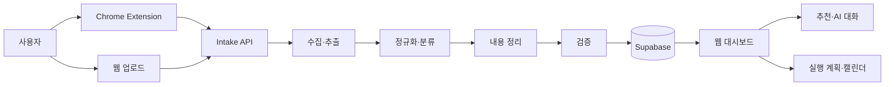

# KEEP:ON

KEEP:ON은 SNS와 파일에서 저장한 공고·정보를 사용자별로 정리하고, 필요한 경우 추천·대화·실행 계획으로 연결하는 서비스입니다.

대학생과 청년은 공모전, 정책, 교육, 혜택 정보를 Instagram과 Threads에서 자주 발견합니다. 그러나 저장한 게시물은 다시 찾기 어렵고, 마감일·대상·신청 방법을 별도로 정리해야 합니다. KEEP:ON은 사용자가 직접 Keep한 자료만 처리해 제목, 내용, 마감일, 링크, 분류를 저장합니다.


## 입력 방식

| 입력 | 처리 범위 |
| --- | --- |
| Chrome Extension Keep | 로그인된 Instagram 또는 Threads 게시물의 본문·제목·링크·썸네일 증거 수집 |
| 이미지 | 업로드 파일의 텍스트 추출 후 공고 정보 정리 |
| PDF | 업로드 파일의 텍스트 추출 후 공고 정보 정리 |
| 텍스트 | 사용자가 입력한 텍스트를 공고 정보로 정리 |

동영상 자체를 분석하지 않습니다. Instagram 릴스와 일반 게시물은 게시물 캡션·본문을 수집합니다.

## 전체 구조



### Keep 처리 순서

SNS 게시물을 Keep하면 아래 순서로 처리합니다.

1. 확장프로그램이 현재 페이지의 URL, 본문, 제목, 작성자, 링크, OG 메타데이터, 썸네일을 수집합니다.
2. 플랫폼 수집 에이전트가 Instagram 또는 Threads 증거를 게시물 데이터로 변환합니다.
3. 정규화 에이전트가 제목, 본문, 마감일, 조건, 링크를 구조화합니다.
4. 분류와 내용 정리 단계가 `Competition`, `Support`, `Benefit` 분류 및 사용자용 제목·요약을 만듭니다.
5. 검증 단계가 근거와 필수 형식을 확인합니다.
6. `intakes`, `opportunities`, `normalized_opportunities`에 사용자별로 저장합니다.

마감일은 선택 정보입니다. 원문에 근거가 없으면 마감일을 만들지 않고 비어 있는 값으로 저장합니다.

## 에이전트 구성

현재 구현에서 일부 역할은 독립 프로세스가 아니라 하나의 정규화 파이프라인 안의 단계로 동작합니다.

| 구분 | 구현 | 역할 | 실행 시점 |
| --- | --- | --- | --- |
| 플랫폼 수집 | `InstagramExtractionAgent` | Instagram 게시물 증거에서 본문·링크·작성자 추출 | Instagram Keep |
| 플랫폼 수집 | `ThreadsExtractionAgent` | Threads 게시물 증거에서 본문·링크·작성자 추출 | Threads Keep |
| 파일 수집 | `GeminiSourceExtractionAgent` | 이미지·PDF·텍스트에서 원문 텍스트 추출 | 파일 업로드 |
| 정규화 | `PythonBridgeNormalizationAgent` | 제목, 본문, 링크, 마감일, 조건 구조화 | 모든 Intake |
| 분류 | Python 정규화 규칙 | `Competition`·`Support`·`Benefit` 및 정보 유형 분류 | 정규화 단계 |
| 내용 정리 | `GeminiNormalizationAgent` | 사용자가 읽기 쉬운 제목과 요약 정리 | 정규화 이후 |
| 검증 | `ValidationService` | 근거·형식 검증, `READY_FOR_REVIEW` 또는 `NEEDS_REVIEW` 결정 | 저장 전 |
| 추천 | `GeminiRecommendationAgent` | 사용자가 좋아요한 공고만 프로필·관심사·일정 기준으로 정렬 | AI 추천 요청 |
| 대화 | `GeminiConversationAgent` | 저장 공고와 최근 대화 맥락을 근거로 답변 | AI 대화 |
| 자격 판정 | Eligibility Agent | 연령·지역·재학 상태 등 원문 조건과 프로필 비교 | 공고 평가 요청 |
| 준비 여유 판정 | Feasibility Agent | 마감일·준비량·사용 가능 시간을 기준으로 판단 | 공고 평가 요청 |
| 실행 계획 | Execution / Planning Agent | 사용자가 선택한 공고의 실행 순서와 할 일 초안 생성 | 계획 초안 만들기 |
| 캘린더 | CalendarTool | 사용자가 승인한 계획을 일정으로 반영·수정 | 캘린더 반영 |

추천, 자격 판정, 실행 계획은 Keep 직후 자동으로 실행되지 않습니다. 저장 이후 사용자가 좋아요, AI 추천, 계획 만들기 등의 기능을 선택할 때 실행됩니다.

## 저장 데이터

| 테이블 | 용도 |
| --- | --- |
| `profiles` | 사용자 프로필과 개인화 기준 |
| `intakes` | 입력 수신부터 추출·정규화·검증까지의 처리 상태 |
| `opportunities` | 대시보드에 표시하는 사용자별 공고·정보 |
| `normalized_opportunities` | 조건·분류 등 정규화 결과 |
| `intake_files` | 업로드한 파일과 Intake 연결 정보 |

Supabase Row Level Security(RLS)로 사용자는 자신의 데이터만 읽고 수정할 수 있습니다.

## 디렉터리 구조

```text
services/keep-web/
  extension/                   Manifest V3 Chrome Extension
  frontend/                    React + Vite 웹 대시보드
  server/
    agents/                    수집·정규화·추천·대화 에이전트
    workflow.js                Intake 파이프라인
    index.js                   HTTP API
  shared/contracts.js          입력·출력 계약
  tests/                       계약·에이전트·통합 테스트
  docs/                        서비스 세부 설계

src/
  normalization_agent.py       조건·날짜 정규화
  eligibility_agent.py         자격 판정
  feasibility_agent.py         준비 여유 판정
  ranking_agent.py             우선순위·추천 데이터
  execution/                   실행 계획·할 일·캘린더 도구
```

## 기술 구성

- Web: React, TypeScript, Vite
- Extension: Chrome Manifest V3
- API: Node.js HTTP Server
- Agent runtime: Python + Gemini API
- Auth / Database / Storage: Supabase
- Deployment: Google Cloud Run
- Notification demo: Slack Incoming Webhook

## 로컬 실행

### 1. 환경변수 설정

`services/keep-web/.env`에 서버 전용 값을 설정합니다.

```env
GEMINI_API_KEY=...
SUPABASE_URL=...
SUPABASE_ANON_KEY=...
SLACK_WEBHOOK_URL=... # 선택: 데모 알림용
```

`GEMINI_API_KEY`, Supabase 서비스 키, Slack Webhook URL은 프런트엔드·Chrome Extension·GitHub에 넣지 않습니다.

### 2. 서버 실행과 테스트

```bash
cd services/keep-web
npm test
npm start
```

### 3. 웹 대시보드 실행

```bash
cd services/keep-web/frontend
npm install
npm run dev
```

### 4. Chrome Extension 로드

1. Chrome에서 `chrome://extensions`를 엽니다.
2. 개발자 모드를 켭니다.
3. **압축해제된 확장 프로그램을 로드합니다.**
4. `services/keep-web/extension/` 폴더를 선택합니다.
5. 코드 변경 후 확장프로그램 새로고침과 SNS 페이지 새로고침을 함께 수행합니다.

## 주요 API

| 목적 | 메서드 | 경로 |
| --- | --- | --- |
| SNS Keep Intake 생성 | POST | `/v1/intakes` |
| 파일·텍스트 Intake 생성 | POST | `/v1/intakes/source` |
| Intake 상태 조회 | GET | `/v1/intakes/:id` |
| 내 저장 목록 | GET | `/v1/opportunities` |
| 공고 상세 | GET | `/v1/opportunities/:id` |
| 공고 삭제 | DELETE | `/v1/opportunities/:id` |
| AI 추천 | POST | `/v1/agent/recommendations` |
| AI 대화 | POST | `/v1/agent/chat` |
| 실행 계획 생성 | POST | `/v1/agent/execution` |


## 관련 문서

- [프로젝트 범위](./Project.md)
- [전체 아키텍처](./ARCHITECTURE.md)
- [Extension 및 API 실행 안내](./services/keep-web/README.md)
- [KEEP:ON 기술 설계](./services/keep-web/docs/technical-design.md)
