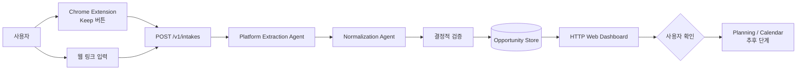

# KEEP:ON

저장은 했는데 다시 확인하지 않아 기회를 놓치는 청년·대학생을 위한 정보 실행 서비스입니다.
사용자가 Instagram·Threads 등의 정보성 게시물을 직접 **Keep**하거나 링크를 입력하면,
본문을 근거와 함께 정리해 대시보드에 표시하고 이후 마감 관리와 실행 계획으로 연결합니다.

## 현재 기준 아키텍처

최종 제품의 전환 대상 아키텍처는 다음과 같습니다.

- Node.js 20 HTTP Web 서버
- Manifest V3 Chrome Extension
- 사용자 Keep 또는 직접 링크 입력만 처리하는 Intake API
- 플랫폼별 Extraction Agent (현재 Instagram·Threads)
- Competition / Support / Benefit Normalization Agent
- HTTP API를 소비하는 웹 대시보드
- Supabase 인증·사용자별 저장(RLS)과 Gemini 정규화
- 사용자 확인 후 Python 실행·추천 Agent와 Calendar/Notification 확장

자동 수집·대량 크롤링은 하지 않습니다. 사용자가 저장을 요청한 현재 페이지의 증거만 처리합니다.
릴스와 동영상은 영상을 분석하지 않고 게시물의 캡션·본문과 링크를 수집합니다.

## 데이터 흐름



Extension이 보내는 `PageEvidencePayload`는 URL, canonical URL, 페이지 제목, 본문, 본문에서
확인한 링크, 게시일, 증거 텍스트를 포함합니다. 로그인 안내 페이지, 게시물 URL 불일치,
본문 부재 등은 성공으로 위장하지 않고 접근 실패 또는 `NEEDS_REVIEW`로 보존합니다.
마감일은 선택값이며 본문에 확정 근거가 없으면 `null`입니다.

## 폴더 구조

```text
services/keep-web/
  extension/                 # Manifest V3 Keep 버튼과 현재 탭 증거 수집
  server/                    # HTTP API, workflow, 저장소, Agent 실행
    agents/                  # 플랫폼 추출·정규화·추후 planning Agent
  shared/contracts.js        # Node 서비스의 입력·출력 계약
  web/                       # HTTP API를 사용하는 기본 대시보드
  fixtures/                  # 로그인 없이 재현 가능한 Instagram/Threads 페이지
  tests/                     # 계약·Extension·HTTP 통합 테스트
  docs/technical-design.md   # 상세 기술 설계
```

## 로컬 실행

```bash
cd services/keep-web
npm test
npm start
```

Chrome에서 `chrome://extensions`를 열고 개발자 모드를 켠 뒤
`services/keep-web/extension/` 폴더를 **압축해제된 확장 프로그램**으로 로드합니다.
서버가 실행되면 다음 fixture 페이지에서 로그인 없이 Keep 흐름을 재현할 수 있습니다.

- http://localhost:4173/fixtures/instagram.html
- http://localhost:4173/fixtures/threads.html

실제 Instagram·Threads 게시물은 로그인된 Chrome 프로필에서 테스트합니다.
코드 수정 후에는 Extension 새로고침과 SNS 페이지 새로고침을 함께 수행합니다.

## 프론트엔드 연결 규칙

프론트엔드는 Agent 파일이나 저장소 모듈을 직접 import하지 않고 HTTP API만 사용합니다.

| 목적 | 메서드 | 경로 |
|---|---|---|
| 저장 목록 | GET | `/v1/opportunities` |
| 저장 상세 | GET | `/v1/opportunities/:id` |
| Intake 상태 | GET | `/v1/intakes/:id` |
| 사용자 확인 | POST | `/v1/opportunities/:id/confirm` |
| 저장 삭제 | DELETE | `/v1/opportunities/:id` |

목록 응답은 `{ "items": [...] }` 형태이며 카드에서 사용하는 핵심 필드는
`title`, `body`/`summary`, `deadline`(null 가능), `canonical_url`, `source_url`,
`links`, `platform`, `category`, `status`, `needs_review`입니다.

별도 React·Next·Vite 프론트는 로컬에서 `http://localhost:4173`을 API 기본 주소로 사용하고,
운영 환경에서는 인증 토큰과 배포 URL을 환경변수로 주입합니다. `local-test-user`를 운영 사용자
식별자로 사용하지 않습니다.

## Agent 협업 규칙

- 현재 Node 서비스의 Agent 코드는 `services/keep-web/server/agents/`에 둡니다.
- 플랫폼별 추출과 정규화를 분리합니다. 예: `instagram-extraction/`, `threads-extraction/`,
  `normalization/`, `planning/`.
- 모든 Agent는 `services/keep-web/shared/contracts.js`의 계약을 사용합니다.
- Agent가 직접 웹 화면이나 저장소를 수정하지 않고 workflow를 통해 결과를 반환합니다.
- 새 Agent와 fixture에는 테스트를 함께 추가하고 `npm test`를 통과시킵니다.
- 공용 계약과 workflow 변경은 팀 합의 후 별도 브랜치 PR로 제출합니다.

## Python Agent와 KEEP:ON의 관계

레포의 Python Agent는 단순 stub이 아니라 별도 기능을 구현하고 있습니다. KEEP:ON Node 서비스는
사용자가 Keep한 SNS 게시물을 개인 저장소에 넣는 진입점이고, Python Agent는 이 저장 데이터를
바탕으로 적격성·추천·실행 계획을 담당합니다.

- `src/extraction_agent.py`, `src/normalization_agent.py`: 링크·텍스트·이미지·PDF 처리와 조건 정규화
- `src/eligibility_agent.py`, `src/feasibility_agent.py`, `src/ranking_agent.py`: 개인화 적격성·추천
- `src/execution/`: 실행 계획, Todo, 캘린더, 알림 흐름
- `app/execution_demo_app.py`: Streamlit 실행 Agent 데모

공통 데이터 계약은 Node의 `Opportunity`와 Python의 `SavedContext`·`NormalizationResult` 사이에서
명시적으로 매핑합니다. 한 런타임이 다른 런타임의 파일을 직접 수정하지 않습니다.

## 현재 단계와 다음 단계

현재 `services/keep-web`은 Gemini 정규화, Supabase Google 로그인, 사용자별 RLS 저장을 포함한
로컬 수직 슬라이스입니다. API 키와 service-role 키는 서버 `.env`에만 둡니다.

다음 단계에서 사용자 인증·DB·실제 Agent 실행 런타임을 붙입니다.

1. 공용 계약을 `src/models.py`와 `shared/contracts.js` 사이에서 확정
2. 링크·텍스트·사진·PDF 직접 입력 API와 Web 화면 연결
3. Python Agent가 사용할 공용 Opportunity 계약 확정
4. 사용자 확인 이후 Python 실행 Agent와 Calendar·Notification 연결

## 문서

- [`Project.md`](./Project.md): 제품 범위와 협업 규칙
- [`ARCHITECTURE.md`](./ARCHITECTURE.md): 실행 아키텍처와 계약
- [`docs/plan_b.md`](./docs/plan_b.md): 기존 Python 데이터 파이프라인 참고 문서
- [`docs/plan_c.md`](./docs/plan_c.md): 개인화 추천·적격성 Agent 문서
- [`docs/plan_d.md`](./docs/plan_d.md): 실행·Todo·Calendar Agent 문서
- [`services/keep-web/README.md`](./services/keep-web/README.md): Extension·API 로컬 실행 안내
- [`services/keep-web/docs/technical-design.md`](./services/keep-web/docs/technical-design.md): 상세 설계
