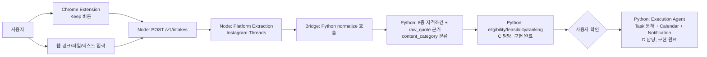

# KEEP:ON

저장은 했는데 다시 확인하지 않아 기회를 놓치는 청년·대학생을 위한 정보 실행 서비스입니다.
사용자가 Instagram·Threads 등의 정보성 게시물을 직접 **Keep**하거나 링크·파일·텍스트를
입력하면, 본문을 근거와 함께 정리해 대시보드에 표시하고 이후 자격 판정·마감 관리·실행
계획으로 연결합니다.

## 시작하기 전에 읽을 문서

| 문서 | 내용 |
|---|---|
| [`Project.md`](./Project.md) | 서비스 정의, 사용자 흐름, 팀 역할 분담, 절대 규칙(R1~R7) — **가장 먼저 읽을 문서** |
| [`ARCHITECTURE.md`](./ARCHITECTURE.md) | 전체 데이터 흐름도(Node 입력 + Python 처리), 모듈 매핑, 공용 계약 |
| [`docs/merge_plan_a_b.md`](./docs/merge_plan_a_b.md) | Node(A)↔Python(B) 브릿지 설계 — 왜 이렇게 나눴는지 |
| [`docs/plan_b.md`](./docs/plan_b.md) | B(데이터·링크 분석) 실행 계획 |
| [`docs/plan_c.md`](./docs/plan_c.md) | C(판정·추천) 실행 계획 |
| [`docs/plan_d.md`](./docs/plan_d.md) | D(실행 에이전트) 실행 계획 |
| [`docs/personas.md`](./docs/personas.md) | 테스트 페르소나 5종 |
| [`docs/db_schema.md`](./docs/db_schema.md) | Supabase 스키마 전체 계획 |
| [`services/keep-web/README.md`](./services/keep-web/README.md) | Chrome Extension·Node 서버 로컬 실행 안내 |

## 전체 아키텍처 (한눈에)



**핵심 원칙**: Node 서비스(A)는 "입력을 받아서 원문을 추출"하는 역할까지만 담당하고,
**자격조건을 구조화하는 정규화(normalization)는 Python 파이프라인(B)이 그대로 담당**한다.
C(판정)와 D(실행)는 이미 완전히 구현되어 있고 둘 다 B의 8종 조건 구조(`ConditionType`,
`EligibilityCondition`, `raw_quote`/`span`)를 그대로 입력으로 쓰기 때문에, 이 계약을 깨면
안 된다. 왜 이렇게 나눴는지는 `docs/merge_plan_a_b.md` 참고.

## 폴더 구조 및 담당자

```
services/keep-web/        # A — Chrome Extension + Node HTTP 서버 (입력·추출 계층)
  extension/                Manifest V3, Keep 버튼
  server/                   Intake API, workflow, platform extraction
  fixtures/                 로그인 없이 재현 가능한 Instagram/Threads 테스트 페이지

src/
  models.py                # A 소유 — 공용 스키마 (draft, 각 모듈 상단 참고)
  supervisor.py             # A — 전체 오케스트레이션
  bridge_server.py           # B — Node → Python 정규화 브릿지 (Flask)
  extraction_agent.py        # B — 링크/파일/이미지/텍스트 → SavedContext (구현 완료)
  normalization_agent.py     # B — 8종 자격조건 구조화 + content_category (구현 완료)
  db.py                      # B — Supabase 저장 레이어
  eligibility_agent.py       # C — 적격 판정 (구현 완료)
  feasibility_agent.py       # C — 실행 가능성 평가 (구현 완료)
  ranking_agent.py           # C — 추천/우선순위 (구현 완료)
  decision_engine.py         # C — 좋아요 기반 추천 엔진 (구현 완료)
  execution/                 # D — Execution Agent 패키지 (Task 분해·Calendar·Notification, 구현 완료)
  planning_agent.py           # D — src/execution 진입점 (얇은 래퍼)
  execution_chat.py           # D — 대화형 일정 조정
  quest_todo.py               # D — Task/진행률 모델
  calendar_agent.py           # D — CalendarTool 진입점

app/
  streamlit_app.py          # E — Frontend (미착수)

data/            # B — 실제 공고 20건 + 정규화 결과 (테스트 픽스처)
scripts/         # B — 파이프라인 검증 스크립트
supabase/migrations/   # A 스키마(profiles/intakes/opportunities) + B 확장분(content_category/conditions)
docs/            # 팀 전체 계획 문서
```

각 파일 상단에 `OWNER:` 주석으로 담당자를 표시했습니다.

## 실행 방법

**Python 파이프라인 (B/C/D)**
```bash
python3.11 -m venv .venv && source .venv/bin/activate
pip install -r requirements.txt

cp .env.example .env   # GEMINI_API_KEY=, SUPABASE_URL=, SUPABASE_KEY= 채우기

python -m src.extraction_agent       # 추출 데모
python -m src.normalization_agent    # 정규화 데모 (8종 조건 + content_category)
python -m scripts.run_pipeline       # 20건 전체 파이프라인 검증
python -m src.execution.demo         # 실행 에이전트 E2E 데모
pytest tests/                        # C/D 테스트
```

**Node 서비스 (A) — Chrome Extension + HTTP 서버**
```bash
cd services/keep-web
npm install
npm test
npm start   # 기본 포트 4173/4174
```
Chrome에서 `chrome://extensions` → 개발자 모드 → `services/keep-web/extension/`을
압축해제된 확장 프로그램으로 로드. 로그인 없이 테스트하려면
`http://localhost:4173/fixtures/instagram.html` / `.../threads.html` 사용.

**브릿지 서버 (B, Node↔Python 연결)**
```bash
python -m src.bridge_server   # 기본 포트 5001, Node workflow.js가 이걸 호출
```

## 현재 상태 요약

| 담당 | 상태 |
|---|---|
| A (Node/Extension) | Chrome Extension + Intake API + Instagram/Threads 추출 **구현 완료** |
| B (Python 정규화) | extraction/normalization/DB 저장 **구현 완료**, 실제 20건 검증 완료, Gemini 실연동 |
| C (판정/추천) | eligibility/feasibility/ranking/decision_engine **구현 완료**, 테스트 포함 |
| D (실행 에이전트) | Task 분해/Calendar/Notification **구현 완료**, 콘솔·Streamlit 데모 동작 |
| E (Frontend) | 미착수 |

절대 규칙(R1~R7)과 상세 계약은 `Project.md`/`ARCHITECTURE.md` 참고.
