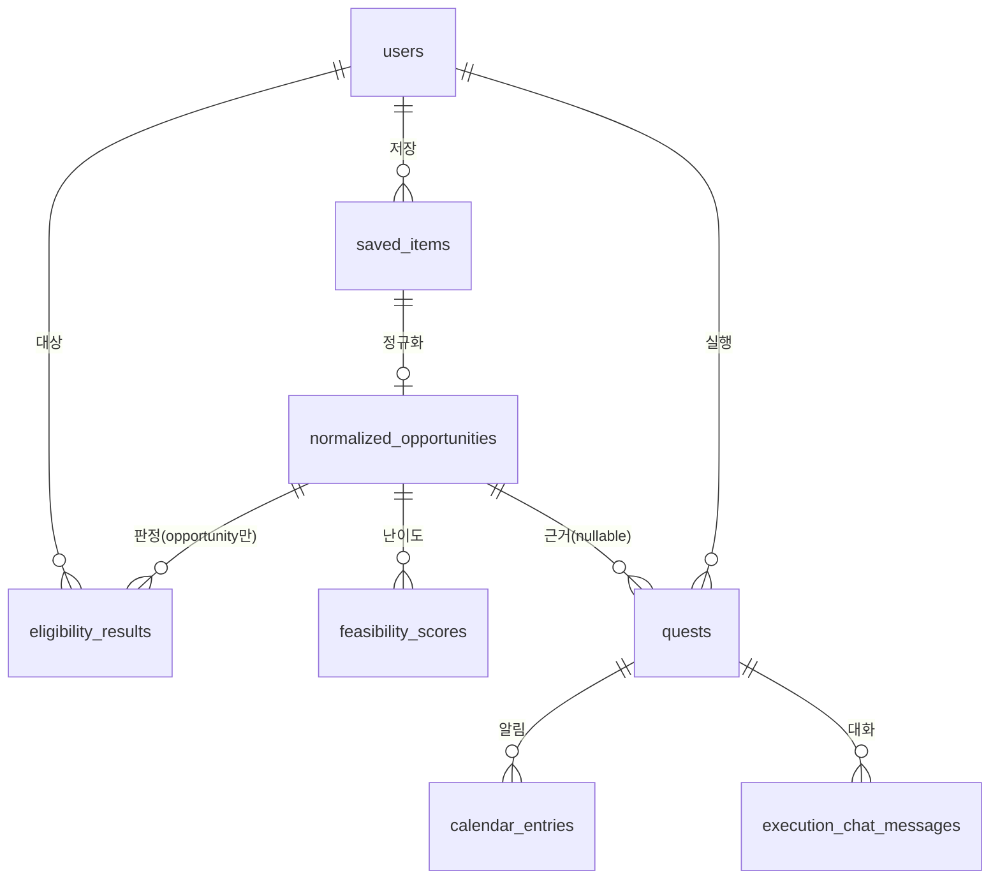

# DB 스키마 계획 (Supabase/Postgres)

> 이 문서는 실제 테이블 생성 전 설계 초안이다. ARCHITECTURE.md의 데이터 흐름(1절)과
> 공용 계약(3절)을 그대로 테이블로 옮긴 것 — **A/C/D 리뷰 필요**, 특히 auth 전략과
> PK 설계는 A(models.py 소유)와 반드시 맞춰야 한다.

## 왜 필요한가

Project.md 원래 계획은 "데이터: 로컬 JSON 파일 (DB 없음)"이었지만, Supabase로 전환하기로
결정됨에 따라 지금까지 로컬 JSON으로 검증한 스키마(`SavedContext`, `NormalizationResult` 등)를
관계형 테이블로 옮긴다. Pydantic 모델 필드는 그대로 유지하고, 컬럼만 매핑한다.

## 전체 ER 개요

## 테이블 정의

### 1. `users` — A 담당 (profile_agent.py 출력)

| 컬럼 | 타입 | 설명 |
|---|---|---|
| id | uuid, pk | Supabase Auth 쓸지 앱 자체 uuid로 갈지 **A와 결정 필요** |
| birth_year | int | R7: 생년월일 아닌 연도만 |
| region | text | 시/군/구 단위까지만 (R7) |
| status | text | 재학/휴학/졸업/졸업예정/미취업/재직 등 |
| income_bracket | text, nullable | 온보딩 선택 입력. `docs/personas.md`에서 발견한 이슈: 지금처럼 "100% 이하"류 뭉뚱그린 문자열이면 정밀 매칭이 안 됨 — 퍼센트 구간 enum이나 숫자 컬럼으로 바꾸는 게 나을 수 있음 (C와 논의) |
| interest | text | 관심사 한 줄 |
| created_at | timestamptz | |

### 2. `saved_items` — B 담당 (extraction_agent.py 출력 = SavedContext)

| 컬럼 | 타입 | 설명 |
|---|---|---|
| id | uuid, pk | |
| user_id | uuid, fk → users.id | |
| source_type | text | link / file / image / text / extension(예정) |
| source_value | text | url / 파일경로 / 원본텍스트 |
| title | text, nullable | |
| raw_text | text, nullable | |
| status | text | ok / partial / failed (R3) |
| error_reason | text, nullable | |
| fetched_at | timestamptz | |
| created_at | timestamptz | |

### 3. `normalized_opportunities` — B 담당 (normalization_agent.py 출력 = NormalizationResult)

| 컬럼 | 타입 | 설명 |
|---|---|---|
| id | uuid, pk | |
| saved_item_id | uuid, fk → saved_items.id | 1:1에 가까움(하나의 저장 항목 = 하나의 정규화 결과) |
| content_category | text, nullable | opportunity / time_sensitive_info / general_info |
| conditions | jsonb | `[{type, operator, value, raw_quote, span}]` — 그대로 배열로 저장, 구조 고정 안 하고 유연하게 |
| status | text | ok / partial / failed |
| notes | text, nullable | |
| created_at | timestamptz | |

**주의**: `conditions`는 정규화된 컬럼으로 쪼개지 않고 jsonb로 통째로 저장 추천 — 조건 개수가
가변적이고, `raw_quote`+`span` 근거 검증(R2)은 이미 코드 레벨(`_verify_grounding`)에서
끝난 상태로 들어오므로 DB가 다시 검증할 필요 없음. 대신 `type`별 필터링이 잦다면
`GIN` 인덱스를 `conditions`에 걸어두는 걸 권장.

### 4. `eligibility_results` — C 담당 (eligibility_agent.py 출력, 아직 미구현)

| 컬럼 | 타입 | 설명 |
|---|---|---|
| id | uuid, pk | |
| normalized_opportunity_id | uuid, fk | `content_category='opportunity'`인 것만 여기 들어옴 |
| user_id | uuid, fk | |
| verdicts | jsonb | `[{condition_type, passed, reason}]` — 조건별 충족여부 + 근거 |
| overall_status | text | eligible / ineligible / uncertain |
| created_at | timestamptz | |

### 5. `feasibility_scores` — C 담당 (feasibility_agent.py 출력, 아직 미구현)

| 컬럼 | 타입 | 설명 |
|---|---|---|
| id | uuid, pk | |
| normalized_opportunity_id | uuid, fk | |
| user_id | uuid, fk | |
| difficulty_score | numeric, nullable | |
| notes | text, nullable | |
| created_at | timestamptz | |

(`ranking_agent.py`의 우선순위는 위 두 테이블 + `normalized_opportunities.conditions`의 마감일을
조합해 쿼리 시점에 계산하는 게 나아 보임 — 별도 테이블 불필요, C와 확인 필요)

### 6. `quests` — D 담당 (quest_todo.py / planning_agent.py 출력, 아직 미구현)

| 컬럼 | 타입 | 설명 |
|---|---|---|
| id | uuid, pk | |
| user_id | uuid, fk | |
| normalized_opportunity_id | uuid, fk, **nullable** | `general_info`(마감 없는 "해볼래?" 제안)는 근거가 있어도 판정 없이 바로 여기로 옴 — ARCHITECTURE.md 1-1절 라우팅 규칙 반영 |
| title | text | |
| deadline | timestamptz, nullable | `time_sensitive_info`/`opportunity`는 있음, `general_info`는 없음 |
| status | text | open / done / overdue |
| created_at, updated_at | timestamptz | |

### 7. `calendar_entries` — D 담당

| 컬럼 | 타입 | 설명 |
|---|---|---|
| id | uuid, pk | |
| quest_id | uuid, fk | |
| reminder_at | timestamptz | |
| created_at | timestamptz | |

### 8. `execution_chat_messages` — D 담당

| 컬럼 | 타입 | 설명 |
|---|---|---|
| id | uuid, pk | |
| quest_id | uuid, fk | |
| role | text | user / agent |
| content | text | |
| created_at | timestamptz | |

## 결정이 필요한 것 (A/팀 전체와 논의)

1. **Auth 전략**: Supabase Auth(이메일/소셜 로그인)를 쓸지, 아니면 온보딩만으로 익명 `user_id`를 발급할지. Project.md 온보딩(30초, 출생연도·지역·상태·소득구간·관심사)엔 로그인 언급이 없어서 후자에 가까워 보임 — 대회 데모 관점에서도 로그인 없는 쪽이 빠름.
2. **`income_bracket`을 문자열로 둘지, 퍼센트 숫자 컬럼으로 바꿀지** — `docs/personas.md`에서 발견한 실제 매칭 정밀도 문제와 직결.
3. **RLS(Row Level Security)** 정책 — 익명 사용자 기반이면 `user_id`를 클라이언트가 자체 발급한 uuid로 세션에 저장하고, RLS는 최소한으로(해커톤 범위에선 스킵하고 서비스 롤 키로 서버 사이드에서만 접근하는 것도 방법).
4. **B 파트가 지금 당장 만들 것**: `saved_items`, `normalized_opportunities` 2개 테이블 + Supabase 클라이언트 연동 (아래 다음 단계 참고). 나머지 6개는 각 담당자가 필요할 때 추가.

## 다음 단계 — ✅ 완료 (2026-08-13)

1. [x] `.env`에 `SUPABASE_URL`, `SUPABASE_KEY`(secret 키) 추가
2. [x] `pip install supabase`
3. [x] `saved_items`, `normalized_opportunities` 테이블 생성 — `supabase/migrations/0001_saved_items_and_normalized_opportunities.sql`, RLS 활성화(정책은 아직 없음 = anon/authenticated 기본 차단, secret 키는 우회)
4. [x] `src/db.py`: `save_saved_context()`, `save_normalization_result()` — extract()/normalize()는 순수 함수로 그대로 두고, 저장은 별도 함수로 분리
5. [x] `scripts/seed_supabase.py`로 실제 20건을 DB에 적재 — `saved_items` 20행, `normalized_opportunities` 20행(opportunity 19 · general_info 1), FK/cascade delete 검증 완료

**C에게**: 이제 `data/normalization_results.json`(로컬 스냅샷) 대신 Supabase `normalized_opportunities` 테이블을 직접 쿼리해도 됩니다 — `content_category='opportunity'`로 필터링하면 판정 대상만 바로 나옵니다.

## 다음으로 논의할 것

- A의 `users` 테이블 생성 후 `saved_items.user_id`에 FK 제약 추가 (지금은 제약 없는 uuid 컬럼)
- C/D가 각자 테이블(`eligibility_results`, `feasibility_scores`, `quests` 등) 만들 때 이 문서의 설계를 기준으로 상의
